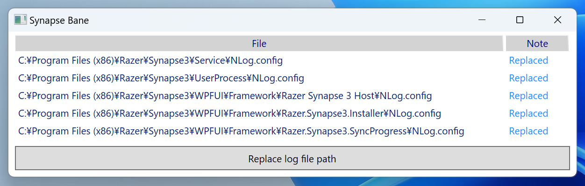

# Synapse Bane

Stop Razor Synapse 3 from automatically creating `c:\temp\` folder by changing NLog config files.

 - [Synapse 3 "temp" folder being created?](https://www.reddit.com/r/razer/comments/lau14y/synapse_3_temp_folder_being_created)

